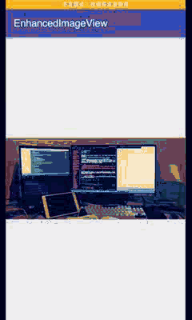

## EnhancedImageView


一个增强的自定义ImageView,具备手势放大缩小等功能,主要原理的是 `Matrix` + `ScaleGestureDetector` + `GestureDetector` 进行对图片进行移动与裁剪

-------------------

- 单指滑动
- 多指滑动
- 双击放大(2倍)
- 放大状态双击恢复
- 手势放大
- 无与ViewPager滑动冲突




-----

## License

```
Copyright 2017 Jerey-Jobs.

Licensed under the Apache License, Version 2.0 (the "License");
you may not use this file except in compliance with the License.
You may obtain a copy of the License at

   http://www.apache.org/licenses/LICENSE-2.0

Unless required by applicable law or agreed to in writing, software
distributed under the License is distributed on an "AS IS" BASIS,
WITHOUT WARRANTIES OR CONDITIONS OF ANY KIND, either express or implied.
See the License for the specific language governing permissions and
limitations under the License.
```
